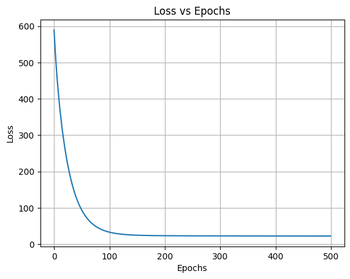

# Boston Housing Price Prediction — Epoch vs Loss

This project demonstrates how increasing the number of training epochs in a neural network reduces the training loss using the Boston Housing dataset.

## Objective
To visualize and prove that training longer (more epochs) helps the model minimize loss — up to a certain point — before overfitting begins.

## Dataset
The project uses the Boston Housing dataset, which contains information about housing prices in Boston suburbs.

- Features: 13 numerical attributes (e.g., RM, LSTAT, PTRATIO)
- Target: Median value of owner-occupied homes (MEDV)

## Workflow Overview
1. Data Loading and Exploration  
   - Load dataset using scikit-learn  
   - Perform feature scaling  
2. Model Definition  
   - Simple feedforward neural network using PyTorch  
3. Training  
   - Train model with different numbers of epochs  
   - Track loss across epochs  
4. Visualization  
   - Plot the relationship between Epochs and Loss  

## Key Results
- As epochs increase, training loss consistently decreases  
- After a certain point, further epochs yield diminishing returns  
- Demonstrates the concept of convergence in gradient descent  

## Visualization

The plot below shows how the loss decreases as the number of epochs increases:



## Requirements
Install dependencies:
```bash
pip install torch torchvision matplotlib scikit-learn

